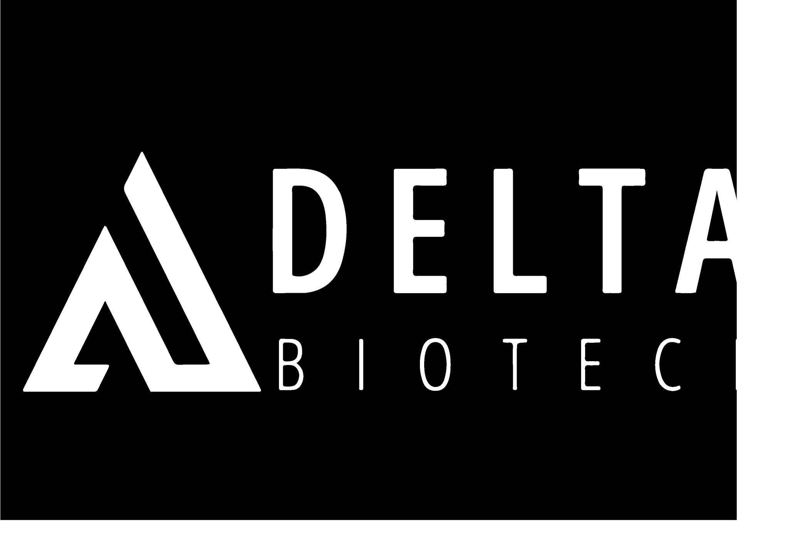
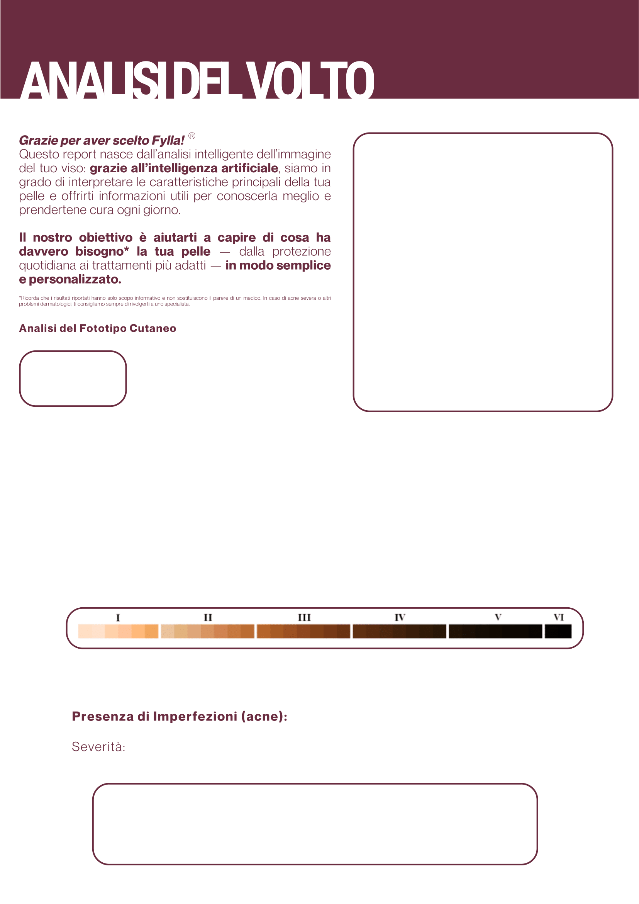
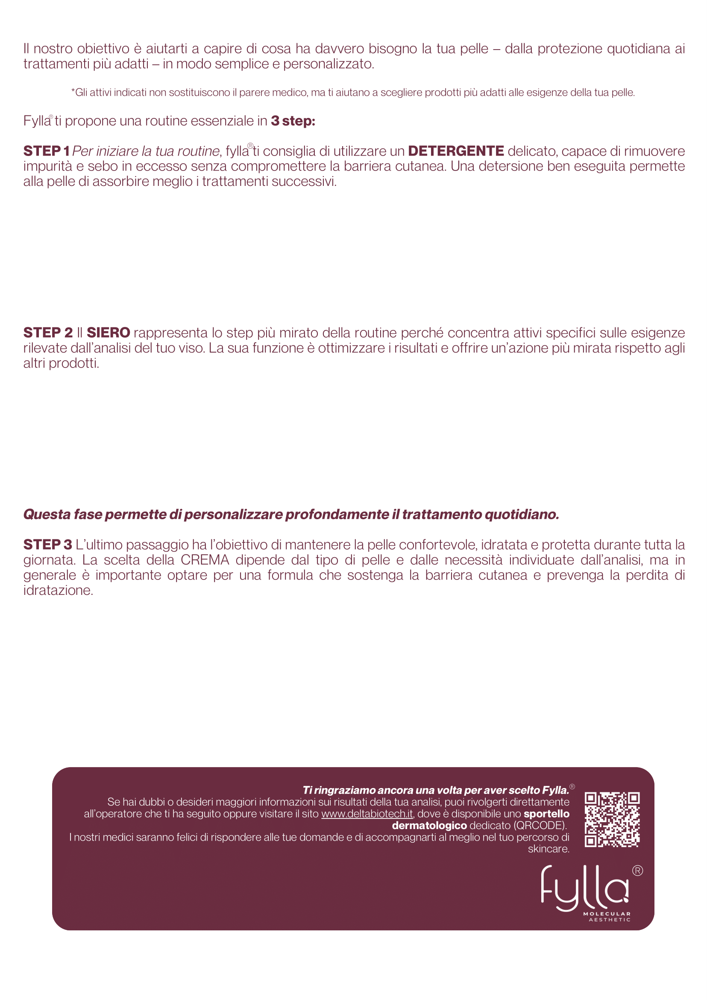

# Fylla Showcase

Public companion repository for the Fylla website and for the publishable workflow behind the periocular-analysis extension I designed.

  <a href="https://deltaskincare.it/">Live Website</a> |
  <a href="docs/periocular-workflow.md">Periocular Workflow</a>

  
  
  
  

## Overview

Fylla is a production website deployed at [deltaskincare.it](https://deltaskincare.it/) for guided facial-image analysis and product-oriented skincare reporting.

The original private implementation remains private for two reasons:

- the main acne-detection model was developed outside my authorship and is not mine to redistribute
- the production repository contains company-specific logic, weights, and integration details that should not be public

This repository is therefore a public-facing showcase. It documents the parts I can safely present: the website/product work I built and the high-level workflow of the periocular-analysis extension I later designed for dark circles, eye bags, and age-related under-eye cues.

## What I contributed

My contribution to Fylla focused on two areas:

- the website and user-facing product flow, including the frontend experience around onboarding, image submission, analysis delivery, and history/report presentation
- the design and integration of a second computer-vision workflow centered on the eye area, later used to support dark circles and related periocular signs

## Website scope

The production website is organized around a simple user journey:

- login and authenticated dashboard access
- guided start of a new analysis
- image upload / acquisition flow
- result presentation inside the web app
- report-like output pages and user history

This public repository does **not** release the production source code. It only presents the product scope and the shareable technical workflow.

## Visual material

### Report output layout

<table>
  <tr>
    <th align="center" width="50%">Analysis page</th>
    <th align="center" width="50%">Routine page</th>
  </tr>
  <tr>
    <td align="center" width="50%">
      
    </td>
    <td align="center" width="50%">
      
    </td>
  </tr>
  <tr>
    <td align="center">The report layout explains the face-analysis outcome, skin-tone context, and acne-related summary.</td>
    <td align="center">The second page turns the analysis into a readable routine recommendation flow.</td>
  </tr>
</table>

### Interface art direction

  
   
  <b>One of the visual assets used to shape the website's landing and brand atmosphere.</b>

## Periocular-analysis workflow

The eye-area extension is described in a public-safe way in [docs/periocular-workflow.md](docs/periocular-workflow.md).

That document explains the shareable parts of the work:

- face and landmark-guided cropping of the under-eye region
- transfer learning on a pretrained facial backbone
- multi-task training for bags and age-related cues
- dataset-cleaning passes to reduce label noise
- later extension toward dark-circle analysis with replay to preserve prior behavior
- packaging the model for website inference

## What is intentionally omitted

To keep this repository portfolio-safe and respectful of ownership boundaries, I am not publishing:

- the private production repository
- the acne-model weights and related implementation
- the periocular-model weights
- the original Colab notebook
- internal training code, exact hyperparameters, and deployment details
- company-specific business logic or operational integrations

## Notes

- This repository is a showcase, not a source release of the full production application.
- Brand assets shown here are included only to document the product I worked on.
- If you want the technical narrative, start from [the periocular workflow document](docs/periocular-workflow.md).
